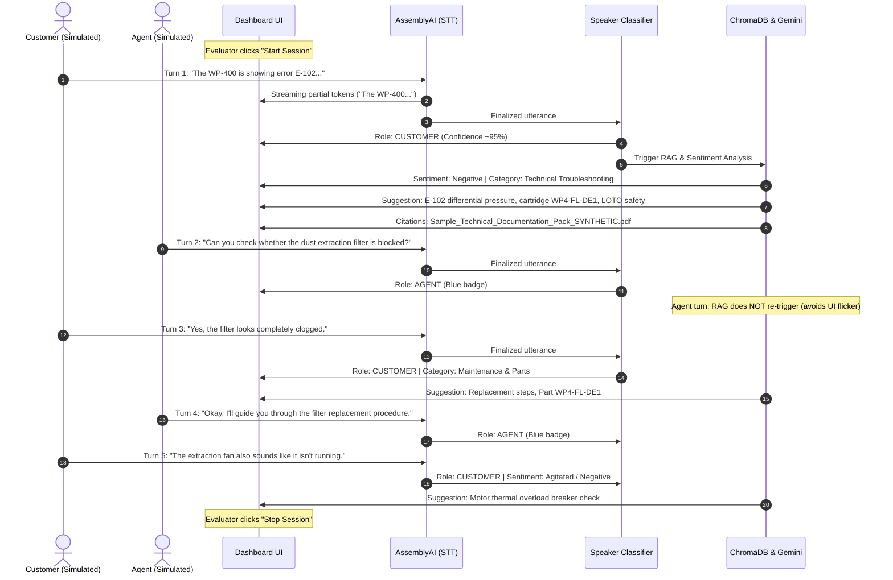

# Evaluator Manual Testing Script: AI-Powered Customer Support Assistant

## Comprehensive Testing & Verification Guide for Deployed/Hosted Applications

> **Audience:** External evaluators, technical reviewers, and compliance auditors testing a deployed or hosted instance of the AI-Powered Customer Support Assistant.
> **Prerequisites:** A web browser (Google Chrome or Microsoft Edge recommended), internet connectivity, and an operational audio input device (headset/microphone).
> **Format:** Numbered, step-by-step procedures with exact sample inputs, visible expected outcomes, verification criteria, and a fillable results checklist.

---

## Table of Contents
1. [Section A: Application Access & Environment Setup](#section-a-application-access--environment-setup)
2. [Section B: Authentication & Session Verification](#section-b-authentication--session-verification)
3. [Section C: Dashboard Interface & Initial State Verification](#section-c-dashboard-interface--initial-state-verification)
4. [Section D: Live Conversation End-to-End Evaluation](#section-d-live-conversation-end-to-end-evaluation)
5. [Section E: Knowledge-Base Grounding, Provenance & Safety](#section-e-knowledge-base-grounding-provenance--safety)
6. [Section F: Negative & Edge-Case Testing](#section-f-negative--edge-case-testing)
7. [Section G: Evaluator Results Checklist Table](#section-g-evaluator-results-checklist-table)
8. [Section H: Troubleshooting Guide](#section-h-troubleshooting-guide)

---

## Section A: Application Access & Environment Setup

### 1. Target URL
Open your web browser and navigate to the deployed application URL:
```text
https://<DEPLOYED_APP_URL>
```
*(If evaluating in a local or staging test environment, replace the placeholder with the designated URL, e.g., `http://localhost:5000` or your assigned staging domain).*

> [!IMPORTANT]
> **Secure Context Requirement (HTTPS / WSS):**
> Modern web browsers restrict microphone capture and secure cookies to secure contexts (`https://` or `localhost`). In any remote or cloud deployment, the application must be served over HTTPS so that audio capture and `SameSite=Lax` cookies operate without browser restrictions. Outbound WebSocket connections will connect over `wss://`.

### 2. Evaluator Prerequisites
1. **Supported Browsers:** Google Chrome (v115+) or Microsoft Edge (v115+) are strongly recommended for full HTML5 Web Audio and WebSocket streaming support.
2. **Audio Hardware:** A working microphone or USB headset connected to the testing device.
3. **Network Permissions:** Unrestricted outbound WebSocket traffic on ports 80/443 (ensure your corporate VPN or proxy does not terminate persistent streaming WebSocket connections).
4. **Third-Party Cookies:** Ensure browser settings allow first-party session cookies for the application domain.
5. **Architectural Notice on Audio Processing:** The application processes audio in volatile memory (16 kHz mono 16-bit PCM). Voice frames are streamed in-memory directly to speech transcription APIs—**no audio recordings are written to disk**.

---

## Section B: Authentication & Session Verification

The application enforces server-side session authentication with `HttpOnly` session cookies protecting `/dashboard`, `/ws/live`, and related APIs.

### Test B.1: Accessing the Login Portal
1. Navigate to: `https://<DEPLOYED_APP_URL>/login` (or visit `https://<DEPLOYED_APP_URL>/`, which redirects unauthenticated visitors to `/login`).
2. **Expected Result:**
   - The industrial-themed login page displays cleanly centered on the screen (card width: ~450px).
   - The brand title reads: **AI Support Assistant / Industrial Technical Copilot**.
   - Two mode tabs appear at the top: **Sign In** (active) and **Create Account**.
   - Input fields: **Work Email** and **Password** (with an eye icon on the right).
   - Below the button, a **Local POC Demo Accounts** section displays quick auto-fill buttons for both authorized demo agents:
     - `boomika@support.industrial.ai` (Boomika)
     - `alex@support.industrial.ai` (Alex Chen)
   - A theme toggle button (moon/sun icon) appears in the top-right corner.

---

### Test B.2: Password Show / Hide Visibility Toggle
1. In the **Password** field, type: `Industrial@2026`.
2. Observe that the password characters are masked with dots by default (`type="password"`).
3. Click the **Eye Icon** inside the right side of the password field.
4. **Expected Result:**
   - Password characters become visible in plain text (`type="text"`).
   - Button tooltip/label changes to **"Hide password"**.
   - The entered text is completely preserved.
   - The form is **not** submitted.
5. Click the eye icon again.
6. **Expected Result:**
   - Password characters return to masked dots (`type="password"`).
   - Button tooltip/label changes to **"Show password"**.

---

### Test B.3: Invalid Credentials Denied
1. Enter `boomika@support.industrial.ai` with an incorrect password: `WrongPassword#999`.
2. Click **Sign In**.
3. **Expected Result:**
   - An amber/red error alert appears: *"Invalid email or password."*
   - Access is denied; the browser remains on `/login`.
   - No stack trace or internal diagnostic data is exposed.

---

### Test B.4: Successful Demo Sign-In (Boomika)
1. In the **Local POC Demo Accounts** panel, click the **Boomika** auto-fill chip (or manually type `boomika@support.industrial.ai` and `Industrial@2026`).
2. Click **Sign In**.
3. **Expected Result:**
   - The button shows a loading spinner (*"Signing in..."*).
   - A success alert briefly displays (*"Authentication successful! Redirecting to dashboard..."*).
   - The browser redirects to `/dashboard`.
   - The dashboard header displays the authenticated agent identity: **`Agent: Boomika`**.
   - An `HttpOnly` session cookie named `session_id` is stored in the browser.

---

### Test B.5: Safe Logout & Route Re-Protection
1. In the top-right header of `/dashboard`, click the red **Logout** button.
2. **Expected Result:**
   - Active audio/transcription streams shut down cleanly.
   - The server session is invalidated, and the cookie is cleared.
   - The browser redirects immediately to `/login`.
3. In the browser address bar, manually type `https://<DEPLOYED_APP_URL>/dashboard` and press Enter.
4. **Expected Result:**
   - The protected route rejects unauthenticated access and redirects back to `/login`.

---

### Test B.6: Secondary Demo Account Sign-In (Alex Chen)
1. Click the **Alex Chen** auto-fill chip (or type `alex@support.industrial.ai` with password `Machinery#400`).
2. Click **Sign In**.
3. **Expected Result:**
   - Signs in successfully and redirects to `/dashboard`.
   - Header identity displays: **`Agent: Alex Chen`**.
4. Click **Logout** to return to `/login`.

---

### Test B.7: Account Registration ("Create Account")
1. On the login page, click the **Create Account** tab (or the *"Don't have an account? Create one here"* link).
2. Observe the registration form fields:
   - **Agent Full Name**
   - **Work Email**
   - **Password** (min 10 characters)
   - **Confirm Password**
3. **Test Validation Rules:**
   - *Short Password:* Enter name `Test Agent`, email `agent.test@support.industrial.ai`, and password `Short1` in both fields. Click **Create Account**.
     → **Expected Result:** Error displays: *"Password must be at least 10 characters long."*
   - *Mismatched Passwords:* Enter password `ValidPassword#1` and confirm password `DifferentPassword#2`. Click **Create Account**.
     → **Expected Result:** Error displays: *"Passwords do not match. Please re-enter."*
   - *Duplicate Email:* Enter name `Boomika Clone`, email `BOOMIKA@SUPPORT.INDUSTRIAL.AI`, password `TestPassword#2026` in both fields. Click **Create Account**.
     → **Expected Result:** Error displays: *"An account with email 'boomika@support.industrial.ai' already exists."*
4. **Submit Valid Registration:**
   - Full Name: `Morgan Vance`
   - Work Email: `morgan.vance@support.industrial.ai`
   - Password: `PrecisionOps#2026`
   - Confirm Password: `PrecisionOps#2026`
   - Click **Create Account**.
5. **Expected Result:**
   - Success banner displays (*"Account created successfully! Redirecting to dashboard..."*).
   - Browser redirects to `/dashboard`.
   - Header identity displays: **`Agent: Morgan Vance`**.

> [!NOTE]
> **In-Memory Registry Limitation (POC Design):**
> To keep this localhost/demonstration POC lightweight and dependency-free, newly registered accounts are stored in the server's thread-safe in-memory registry. Newly registered accounts **will not persist across server restarts**. The two primary demo accounts (`boomika@support.industrial.ai` and `alex@support.industrial.ai`) are built into the initialization code and will always be available upon reboot.

---

## Section C: Dashboard Interface & Initial State Verification

Sign in as **Boomika** (`boomika@support.industrial.ai`) and inspect the dashboard layout before initiating audio capture.

### 1. Visual Layout Check (1280px+ Viewport)
Confirm that the screen is divided into two primary operational zones:
- **Top Header Bar:**
  - Status Beacon: Green dot with **Connected** label.
  - Telemetry Pills: Session Timer (`00:00:00`), Turn Count (`0 turns`), Device label (`Default Microphone` or audio device).
  - Header Controls: **Agent: Boomika** pill, **Theme Toggle** (moon/sun), green **Start Session** button (enabled), red **Stop Session** button (disabled), and **Logout** button.
  - *Alignment Check:* Verify that none of the header controls overlap or wrap awkwardly.
- **Subsystems Status Strip (Below Header):**
  - Microphone: `Standby` (gray dot)
  - AssemblyAI: `Idle` (gray dot)
  - Speaker Classification: `Ready` (gray dot)
  - Gemini 3.5 Flash-Lite: `Ready` (gray dot)
  - Knowledge Base: `Indexed (68 chunks)` (gray dot)
- **Left Column (Live Conversation Timeline):**
  - Panel Title: **Live Conversation** with live audio beacon showing `IDLE`.
  - Content Area: Placeholder text reading *"Waiting for speech input... Click 'Start Session' above to begin capturing audio."*
- **Right Column (Intelligence & Guidance):**
  - **Customer Sentiment:** Shows *"Awaiting customer speech..."* with neutral pill.
  - **Query Category:** Shows *"Awaiting customer query..."*.
  - **AI Support Suggestions:** Shows *"Ready for support dialogue... AI-generated solutions and manual citations will appear here."*
  - **Knowledge Base Sources:** Shows *"No citations active"*.

### 2. Theme Switching Verification
1. Click the **Theme Toggle** button in the header.
2. **Expected Result:**
   - Dashboard instantly switches to the high-contrast **Industrial Light** palette (crisp light backgrounds, dark slate borders, high-contrast typography).
   - Text remains clearly legible with 15–16px body text and 18px headings.
3. Click the toggle again to return to **Industrial Dark**.

---

## Section D: Live Conversation End-to-End Evaluation

This test verifies the entire real-time pipeline using the standardized industrial troubleshooting scenario (**WP-400 CNC Panel Saw — Error E-102 & Dust Extraction Interlock**).

### Execution Instructions:
1. Ensure your microphone is plugged in and unmuted.
2. Click the green **Start Session** button.
3. **Observe Initialization:**
   - Status beacon switches to **Listening**.
   - Session timer begins incrementing (`00:00:01`, `00:00:02`...).
   - The microphone subsystem indicates **Active**.
   - Stream beacon pulses green with label **LIVE**.
   - "Start Session" disables; red "Stop Session" enables.
4. Speak each turn clearly into the microphone in normal conversational cadence.
5. **Allow 2–3 seconds of silence after each statement** to allow the speech-break detector to finalize the turn and process downstream analysis.

---

### Turn-by-Turn Dialogue Script & Expected Outcomes



---

#### TURN 1 — Customer Problem Statement
**Evaluator Action (Speak into microphone):**
> *"The WP-400 is showing error E-102. The dust extraction fan isn't working."*

**Expected Visible Behavior:**
1. **Live Transcription:** Streaming partial words appear under a pulsing `LISTENING...` badge before consolidating into a final turn card.
2. **Role Classification:** Card displays an amber **`CUSTOMER`** badge with confidence percentage (typically 90%–95%).
3. **Sentiment Analysis:** Updates to **`Negative`** (or **`Agitated`**) with an explanatory note (e.g., *"Customer reporting machine fault and inoperative fan"*).
4. **Query Category:** Updates to **`Technical Troubleshooting`** (high confidence).
5. **AI Support Suggestions:**
   - Green pill: **`Grounded in Documentation`**.
   - **Likely Issue:** Differential pressure fault (>1200 Pa) or extraction fan thermal overload breaker trip.
   - **Recommended Actions:** 2–3 structured action items detailing checking the extraction fan breaker and inspecting filter cartridge `WP4-FL-DE1`.
   - **Safety Warning Banner:** Prominent amber box instructing the technician to turn off the main isolator and observe Lock-Out / Tag-Out (LOTO) procedures.
6. **Knowledge Base Sources:** Citation cards appear referencing `Sample_Technical_Documentation_Pack_SYNTHETIC.pdf`, Page 8, Document Code `TS-WP400-3.1`.

---

#### TURN 2 — Agent Diagnostic Inquiry
**Evaluator Action (Speak into microphone in calm tone):**
> *"Can you check whether the dust extraction filter is blocked?"*

**Expected Visible Behavior:**
1. **Live Transcription:** Utterance is transcribed accurately.
2. **Role Classification:** The system identifies the supportive/inquiry style and tags the turn with a blue **`AGENT`** badge.
3. **Non-Triggering of Redundant RAG:** Downstream vector search does **not** re-trigger; the existing suggestions and source citations remain stable on screen without flickering.

---

#### TURN 3 — Customer Fault Confirmation
**Evaluator Action (Speak into microphone):**
> *"Yes, the filter looks completely clogged."*

**Expected Visible Behavior:**
1. **Role Classification:** Tagged as **`CUSTOMER`** (amber badge).
2. **Sentiment Analysis:** Remains **`Negative`** or **`Neutral`**.
3. **Query Category:** Displays **`Maintenance & Parts`** or **`Technical Troubleshooting`**.
4. **AI Support Suggestions:** Recommends procedure for replacing cartridge `WP4-FL-DE1` (3-month service interval, clean with compressed air from inside out or replace).
5. **Knowledge Base Sources:** Displays citation to `UM-WP400-1.1.3` (User Manual Section 1.1.3).

---

#### TURN 4 — Agent Instructional Response
**Evaluator Action (Speak into microphone):**
> *"Okay, I'll guide you through the filter replacement procedure."*

**Expected Visible Behavior:**
1. **Role Classification:** Labeled with a blue **`AGENT`** badge.
2. **Display Stability:** Suggestions remain steady; agent statement is appended to the transcript timeline.

---

#### TURN 5 — Customer Observation
**Evaluator Action (Speak into microphone):**
> *"The extraction fan also sounds like it isn't running."*

**Expected Visible Behavior:**
1. **Role Classification:** Labeled as **`CUSTOMER`** (amber badge).
2. **Sentiment Analysis:** Flags **`Negative`** or **`Agitated`**.
3. **AI Support Suggestions:** Diagnostic guidance highlights the fan motor thermal breaker and safety interlock on the dust extraction hood.

---

### Concluding the Session
1. Click the red **Stop Session** button.
2. **Expected Result:**
   - Audio capture halts immediately.
   - Subsystem indicators return to **Standby** / **Ready**.
   - Session timer stops counting.
   - **All conversation history, sentiment cards, suggestions, and source citations remain on screen** so the agent can review and document CRM notes.

---

## Section E: Knowledge-Base Grounding, Provenance & Safety

### 1. How to Verify Groundedness
- **Green "Grounded in Documentation" Pill:** Appears in the top-right of the AI Support Suggestions card. This indicates that Gemini 3.5 Flash-Lite successfully grounded every suggested step in the text retrieved from ChromaDB.
- **Inspect Specific Technical Entities:**
  - Part number: `WP4-FL-DE1` (correct cartridge filter).
  - Machine model: `WP-400` (panel saw).
  - Pressure limit: `1200 Pa` differential pressure.
  - Electrical detail: Extraction fan thermal overload breaker.
  If the model were ungrounded or hallucinating, it might suggest generic automotive parts or unreferenced electrical codes.

### 2. Inspecting Knowledge Base Provenance Citations
In the **Knowledge Base Sources** panel at the bottom right, verify that every citation includes:
- **Document Name:** e.g., `Sample_Technical_Documentation_Pack_SYNTHETIC.pdf` or `Kestrel_Machinery_Support_Knowledge_Base_SYNTHETIC.docx`.
- **Document Reference Code:** e.g., `TS-WP400-3.1` or `UM-WP400-1.1.3`.
- **Section Heading:** e.g., `Section 3.1 Error Codes and Alarms`.
- **Page Number:** e.g., `Page 8`.

### 3. Handling Insufficient Documentation (Fallback Verification)
When a query asks about an unlisted machine model or undocumented process (e.g., *"What is the hydraulic pump pressure for the PX-900 laser cutter?"*):
- The assistant retrieves no matching chunks.
- The assistant emits an explicit disclaimer:
  > *"The available documentation does not provide sufficient information to resolve this issue. Escalate to senior technical engineering."*
- The grounding badge is marked as ungrounded (`is_grounded: false`).
- **No fabricated pressures, pinouts, or procedures are generated.**

> [!WARNING]
> **Synthetic Documentation Pack Notice:**
> The ingested documentation files (`Sample_Technical_Documentation_Pack_SYNTHETIC.pdf` and `Kestrel_Machinery_Support_Knowledge_Base_SYNTHETIC.docx`) are purely synthetic demonstration manuals authored for this evaluation. They do not represent genuine commercial equipment documentation.

---

## Section F: Negative & Edge-Case Testing

Execute these tests to confirm system robustness against unexpected inputs, security boundaries, and network faults.

| Test ID | Test Scenario | Action | Expected Outcome |
|:---:|---|---|---|
| **NEG-01** | **Invalid Password** | Submit `boomika@support.industrial.ai` with password `WrongPass123` | Error displayed: *"Invalid email or password."* Session is not created. |
| **NEG-02** | **Empty Login Fields** | Leave email or password empty and click Sign In | Client validation displays: *"Please enter your work email address"* or *"Please enter your password"*. No network request sent. |
| **NEG-03** | **Registration Short Password** | On Create Account tab, enter password with 8 characters (`Short#12`) | Error displayed: *"Password must be at least 10 characters long."* |
| **NEG-04** | **Registration Mismatch** | Enter password `Password12345` and confirm password `Password99999` | Error displayed: *"Passwords do not match. Please re-enter."* |
| **NEG-05** | **Duplicate Email Registration** | Register with `BOOMIKA@SUPPORT.INDUSTRIAL.AI` | Server returns HTTP 400 with message: *"An account with email 'boomika@support.industrial.ai' already exists."* |
| **NEG-06** | **Protected Route Direct Access** | Clear cookies or log out, then open URL `https://<DEPLOYED_APP_URL>/dashboard` | Server immediately redirects browser to `/login`. |
| **NEG-07** | **Protected WebSocket Unauthorized** | Attempt WebSocket connection to `/ws/live` without active session cookie | WebSocket connection closes immediately with code `1008` (Policy Violation); browser redirects to `/login`. |
| **NEG-08** | **Password Visibility Masking** | Toggle password eye button back and forth | Masks text (`type="password"`), reveals text (`type="text"`), preserves value, never submits form. |
| **NEG-09** | **Microphone Hardware Unavailable** | Revoke browser microphone permission or disconnect audio device, then click "Start Session" | System displays status `error` or warning without unhandled crashes. Server logs warning safely. |
| **NEG-10** | **Unsupported Machine Query** | Ask: *"What is the blade feed rate for the ZX-999 plasma saw?"* | System detects missing context, displays ungrounded fallback notice, and refrains from hallucinating specifications. |
| **NEG-11** | **Double Session Start** | Rapidly click "Start Session" multiple times | Button disables immediately upon first click. Server handles `already_running` status without spinning up duplicate threads. |
| **NEG-12** | **Session Logout During Active Call** | Start audio session, speak one turn, then click **Logout** | Active audio stream terminates safely, session cookie is destroyed, and browser redirects to `/login`. |

---

## Section G: Evaluator Results Checklist Table

Print or copy this table to record actual findings during your evaluation session:

| Test ID | Test Description | Expected Result | Pass / Fail | Evaluator Notes / Actual Output |
|:---:|---|---|:---:|---|
| **A-01** | Application URL Access | Portal loads over secure HTTPS with no layout break | [ ] PASS  [ ] FAIL | |
| **B-01** | Demo Login (Boomika) | Authenticates; header shows `Agent: Boomika` | [ ] PASS  [ ] FAIL | |
| **B-02** | Demo Login (Alex Chen) | Authenticates; header shows `Agent: Alex Chen` | [ ] PASS  [ ] FAIL | |
| **B-03** | Password Visibility Toggle | Mask/unmask toggles text correctly; preserves characters | [ ] PASS  [ ] FAIL | |
| **B-04** | Invalid Credentials Rejection | Denies login with clear message; no stack trace | [ ] PASS  [ ] FAIL | |
| **B-05** | Create Account Flow | Registers new agent; redirects to dashboard with name | [ ] PASS  [ ] FAIL | |
| **B-06** | Registration Validation | Enforces >=10 chars, email format, mismatch check | [ ] PASS  [ ] FAIL | |
| **B-07** | Safe Logout | Terminates session; redirects to `/login` | [ ] PASS  [ ] FAIL | |
| **B-08** | Protected Dashboard Route | Redirects unauthenticated `/dashboard` to `/login` | [ ] PASS  [ ] FAIL | |
| **C-01** | Dashboard Initial State | Telemetry at zero, subsystems ready, no text clipping | [ ] PASS  [ ] FAIL | |
| **C-02** | Light / Dark Theme Toggle | Smooth transition; high readability in both modes | [ ] PASS  [ ] FAIL | |
| **D-01** | Audio Start / Stop Controls | Timer starts/stops; beacon indicates `LIVE` vs `IDLE` | [ ] PASS  [ ] FAIL | |
| **D-02** | Speech-to-Text Transcription | Utterance appears accurately on conversation timeline | [ ] PASS  [ ] FAIL | |
| **D-03** | Role: CUSTOMER Turn 1 | Classified as CUSTOMER with amber badge (conf >= 80%) | [ ] PASS  [ ] FAIL | |
| **D-04** | Role: AGENT Turn 2 | Classified as AGENT with blue badge; RAG does not re-run | [ ] PASS  [ ] FAIL | |
| **D-05** | Customer Sentiment | Detects Negative or Agitated emotional tone | [ ] PASS  [ ] FAIL | |
| **D-06** | Query Categorization | Tags Technical Troubleshooting (Turn 1) / Maintenance (Turn 3) | [ ] PASS  [ ] FAIL | |
| **D-07** | AI Suggestion Relevance | Recommends WP-400 E-102 checks, filter `WP4-FL-DE1` | [ ] PASS  [ ] FAIL | |
| **D-08** | Industrial Safety Warning | Prominently displays Lock-Out / Tag-Out (LOTO) box | [ ] PASS  [ ] FAIL | |
| **D-09** | Knowledge Base Citations | Cites `TS-WP400-3.1`, page 8, synthetic PDF manual | [ ] PASS  [ ] FAIL | |
| **E-01** | Grounding Badge Verification | Displays green "Grounded in Documentation" pill | [ ] PASS  [ ] FAIL | |
| **E-02** | Unsupported Query Fallback | Emits disclaimer on undocumented machines; no hallucinations | [ ] PASS  [ ] FAIL | |
| **F-01** | Edge Case Suite (NEG 1-12) | System handles invalid inputs, errors, and auth gracefully | [ ] PASS  [ ] FAIL | |

---

## Section H: Troubleshooting Guide

### 1. Browser Blocks Microphone Permission
- **Symptom:** Subsystem microphone indicator remains red or dashboard status displays an audio error.
- **Remedy:** Click the padlock/settings icon in the browser address bar next to the URL. Ensure **Microphone** is toggled to **Allow**. Reload the page.

### 2. WebSocket Connection Dropped or Disconnected
- **Symptom:** Status beacon reads **Disconnected** (red) and Start Session button is disabled.
- **Remedy:**
  - Verify that the network allows WebSocket connections (`wss://` on HTTPS or `ws://` on HTTP).
  - Inspect the browser developer console (`F12` → **Console**). If error code `1008` is logged, the session expired; visit `/login` to sign in again.

### 3. Transcription Does Not Stream Speech
- **Symptom:** You speak into the microphone, but the `LISTENING...` badge does not appear.
- **Remedy:**
  - Check the audio device label in the dashboard header. Verify that the system's default recording device is selected.
  - Speak in a slightly louder, clearer voice close to the microphone. Background office noise suppression may filter low-volume speech.
  - Verify that the AssemblyAI streaming API key is active and has sufficient account balance.

### 4. Downstream AI Suggestions Delayed
- **Symptom:** Transcription appears, but Suggestions remain in *"Synthesizing..."* for several seconds.
- **Remedy:**
  - In a standard run with persistent client reuse, the end-to-end pipeline takes approximately **2.9 to 3.3 seconds**.
  - If Google AI Studio Free Tier rate limits (15 requests/minute) are momentarily reached, the server queues requests. Wait 5 seconds before speaking the next turn.

### 5. Newly Created Account Does Not Exist After Server Restart
- **Symptom:** You registered an account earlier, but following a host reboot or server restart, login fails.
- **Remedy:** This is the expected design behavior of this local POC in-memory account registry. Use the permanent demo accounts (`boomika@support.industrial.ai` or `alex@support.industrial.ai`), or re-register the test account.
