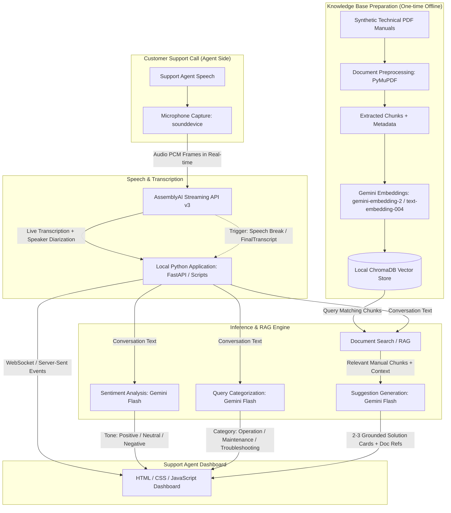

# System Architecture

## AI-Powered Customer Support Assistant (POC)

This document outlines the architecture for the localhost proof-of-concept AI-powered customer support assistant for industrial machinery maintenance and troubleshooting.

---

## 1. High-Level Flow Diagram

---

## 2. Component Breakdown

### A. Microphone Capture (`src/audio_capture.py`)
- Captures audio from system microphone using `sounddevice` (or `PyAudio`).
- Streams raw audio PCM frames directly to AssemblyAI via WebSocket.
- Runs exclusively in memory — **zero audio recording or persistence to disk** ensuring customer privacy and low I/O overhead.

### B. Real-Time Transcription (`src/transcription.py`)
- AssemblyAI Streaming API provides real-time transcription with speaker labels.
- Uses `FinalTranscript` or `utterance_end` speech break tokens as triggers for downstream AI processing.

### C. Knowledge Base Preparation (`scripts/ingest_documents.py`)
- Ingests technical documentation using `PyMuPDF`.
- Chunks text by logical sections, preserving metadata:
  - `source`: File name
  - `page`: PDF page number (1-indexed)
  - `document_reference`: Explicit manual document code (e.g., `UM-WP400-1.1.1`)
  - `section`: Section title
  - `category`: Support category (`Machine Operation Issues`, `Maintenance & Parts`, `Technical Troubleshooting`, `Mixed`)
  - `machine`: Machine identifier (`WP-400`, `SC-900`, `MC-250`, `GC-120`, `All`)
- Embeds chunks into a local persistent `ChromaDB` instance (`./chroma_db`).

### D. Sentiment Analysis (`src/sentiment_analysis.py`)
- Analyzes agent-customer interaction tone using Gemini Flash.
- Outputs structured JSON (`Positive`, `Neutral`, `Negative / Agitated`).

### E. Query Categorization & RAG Search (`src/rag_search.py`)
- Automatically categorizes queries into the 3 SOW categories.
- Queries ChromaDB using embedding similarity and optional metadata filtering by machine/category.

### F. Grounded Suggestions (`src/llm_suggestions.py`)
- Generates 2–3 concise, step-by-step actionable recommendations.
- Strictly grounded in retrieved manual sections with document reference and page citations.
- Outputs *"Not found in the provided manual"* when confidence is low or documentation does not cover the issue.

### G. Agent Dashboard
- Lightweight web UI built with Vanilla HTML, modern CSS, and JavaScript.
- Displays live transcript, sentiment gauge, query categorization badge, and interactive suggestion cards.

---

## 3. Discrepancies and Clarifications Needed for Sign-off

| Item | SOW Specification | Uploaded Tech Stack | Discrepancy / Action Item |
| :--- | :--- | :--- | :--- |
| **LLM Model** | Gemini Flash 2.0 | Gemini 3.8 Flash | Clarify exact API model string with Hemanth (`gemini-2.0-flash` vs `Gemini 3.8 Flash` branding). |
| **Embedding Model**| `text-embedding-004` | `gemini-embedding-2` | Clarify API target (`models/text-embedding-004` vs `gemini-embedding-2`). |
| **Backend API** | Simple scripts / Flask | FastAPI (Python) | FastAPI selected for clean async support and WebSocket readiness. |
| **Vector DB** | ChromaDB or Qdrant | ChromaDB (Local) | ChromaDB local selected to avoid cloud reliance or external cluster setup. |
